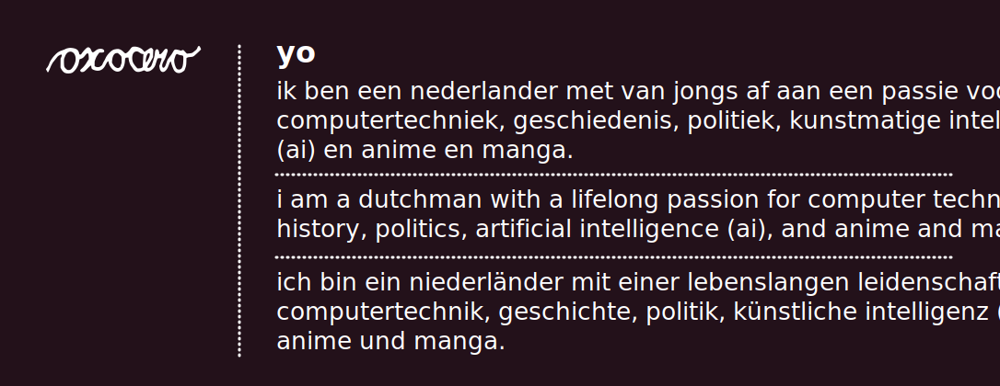

I use this GitHub mostly for personal projects, experiments, and things I’m learning.
That includes systems-level programming, embedded work, and tooling.

**interests**
- systems programming & operating systems
- embedded systems & hardware–software interaction
- programming language design & tooling
- computing history and retro tech

You probably won’t find polished products here — mostly small, focused projects
and ideas I wanted to explore properly.

## long-term projects & directions

Below is a non-exhaustive overview of projects I’m working on or planning over the long term.
Many of these are slow, exploratory efforts meant to span years rather than releases and some of them are private for now.

### terminal UI, tooling & interaction
- **winpatina** — a compatibility layer translating VT/ANSI escape sequences to the Win32 Console API (Windows 2000–10, pre-1511), written in C++.
- **termina** — a modern, component-based terminal UI framework in C11 for building rich, interactive TUIs.
- **termina-demo** — a large collection of example applications showcasing Termina’s capabilities.
- **cursechat** — a TUI-based chat and file transfer application built in Go, using Termina and the EVCCP protocol.

### protocols, serialisation & communication
- **evccp** — an experimental chat and file transfer protocol.
  - `evccp-c`, `evccp-go`, `evccp-py` — reference implementations in C, Go, and Python.
- **evcgf** — a draft design for a Cap’n Proto / Protobuf–like serialization format and RPC framework.

### programming languages & compilers
- **ohayou** — a TypeScript compiler written in Rust, primarily as a learning project in compiler theory and implementation; serves as groundwork for later languages.
- **sumire** — an actor-based systems programming language exploring concurrency, messaging, and capability-style design.
- **reisen** — a toy language inspired by Python, Lua, JavaScript, PHP, and Go, focused on language and compiler design.
- **inaba** — a BASIC-derived toy language influenced by VB, C#, and Reisen.
- **kaas** — a Dutch-syntax toy programming language, Python-like in spirit, created as an exploration of language ergonomics and localisation.

### operating systems & low-level systems
- **hanae** — a capability-based, non-Unix toy operating system with its own filesystem (with database integration), UI toolkit, compositor, core utilities, terminal emulator, and networking stack.
  Influences include SerenityOS and Fuchsia.

### hardware, embedded & retro computing
- **pictrispcb** — a custom PCB implementing a Tetris-like game using a PIC18F4520 microcontroller.
- **big pic** — a Game Boy–esque console built from PIC microcontrollers with an ESP32 or Raspberry Pi Pico.
- **mpf-1b cryptominer** — a cryptominer implemented on the vintage MPF-1B microcomputer.
- **zigled** — a Zig-based controller for a legacy LED badge.
- **v4kard / v4proto / v4mine** — ESP32-based flash cartridges and experiments for the VTech V.Smile platform.

### applications & utilities
- **qt-news** — a Qt-based newsreader with a plugin system for RSS/Atom feeds and web scraping.
- **reducesizefordiscord** — a small Python + FFmpeg utility to re-encode videos to fit Discord’s file size limits.
- **booruscrapertomockapi** — a Python tool that scrapes booru-style imageboards and exposes them via a mock Gelbooru-compatible API.
- **thermalforge** — cross-platform software (Android, web, desktop) for printing to various thermal printers.
- **temae** — a Discord bot.
- **oxocerowatchface** — a custom watchface for the Xiaomi Smart Band 8.

### robotics & educational platforms
- **monobrick-bitmap-converter** — bitmap conversion tools (Python and C#) for LEGO Mindstorms EV3 / Monobrick.
- **ev3.net** — exploration of either a .NET-based stack for EV3 or a custom Debian-based distribution to replace Monobrick.

### web & personal projects
- **oxocero.moe** — my personal website.
- **thorthor.lol** — a small website dedicated to photos of my cat, Thor.
- **exa-pipeline** — an audio processing and AI narration pipeline for audiobooks.

---

*Most of these projects are intentionally exploratory, unfinished, or long-running.
The goal is learning, understanding systems deeply, and building things I’d want to exist — not chasing polish or trends.
The goal is learning, understanding systems deeply, and building things I’d want to exist — not chasing polish or trends.